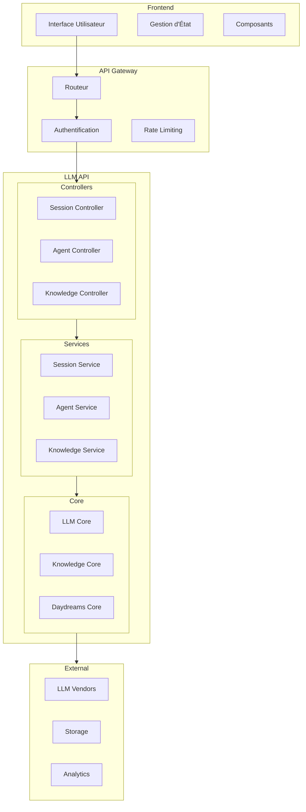
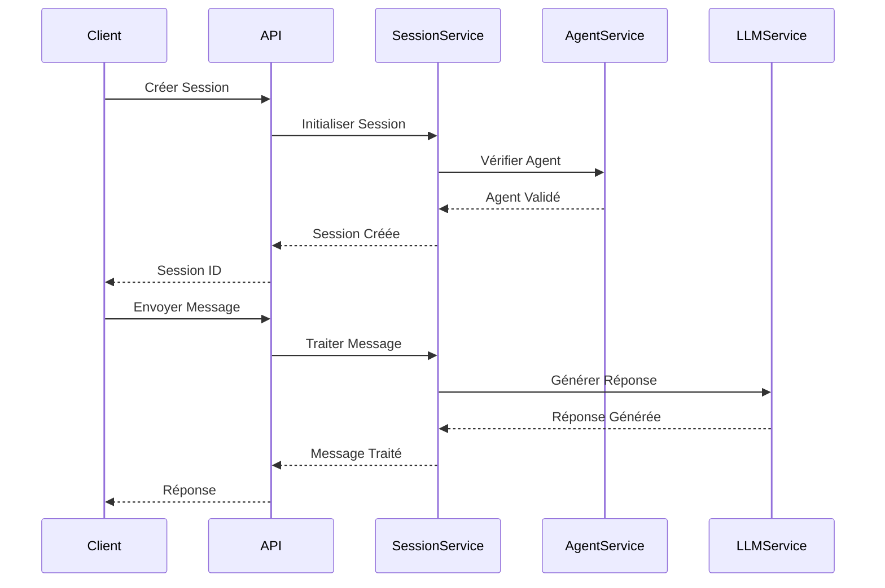
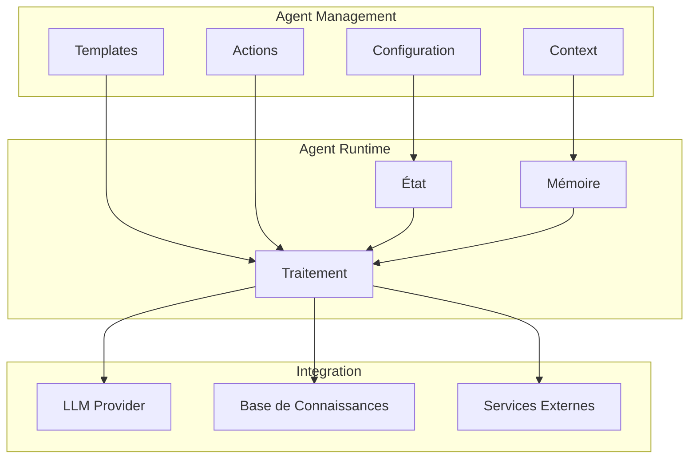
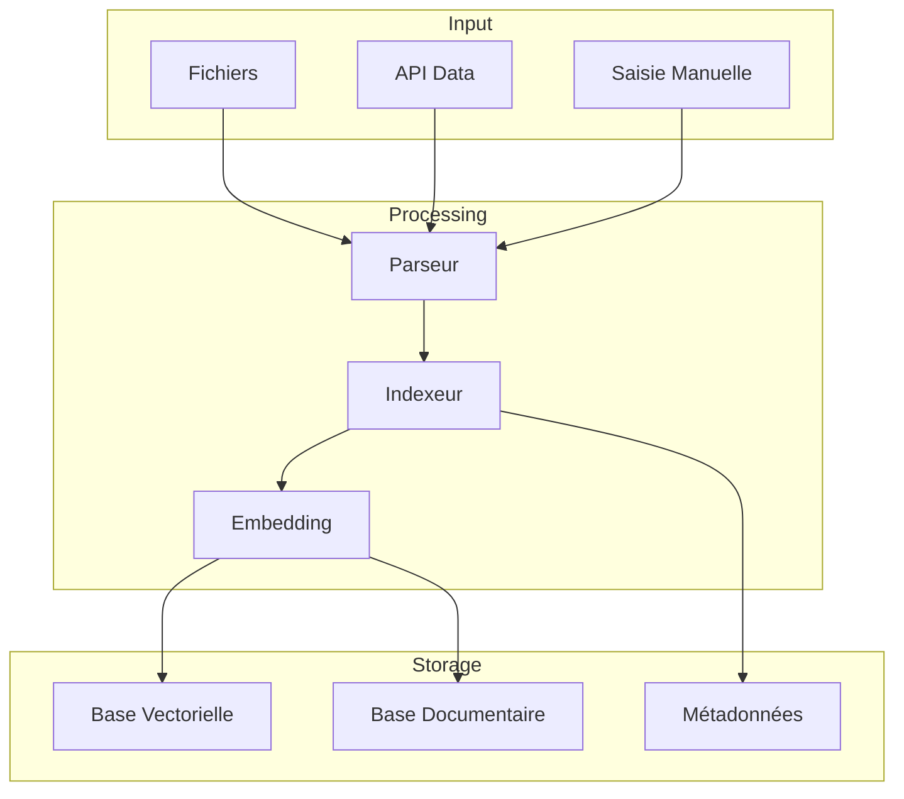
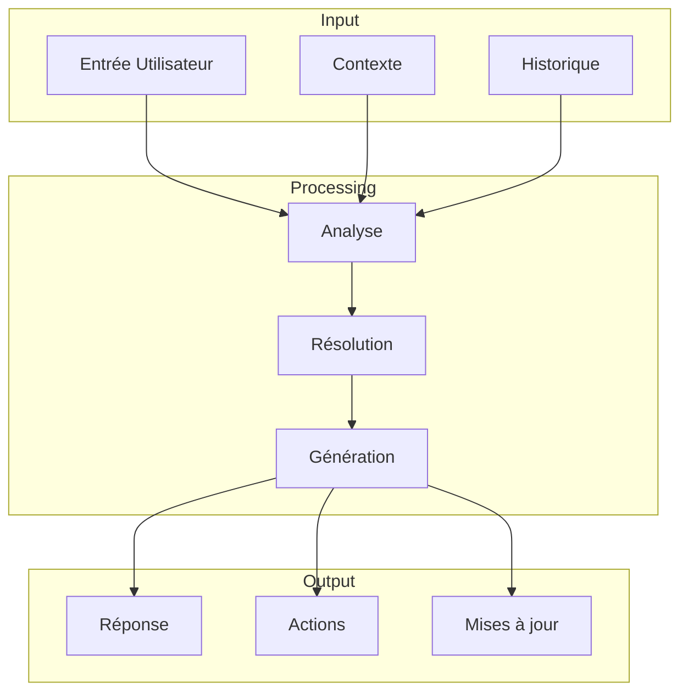

# Architecture Détaillée LLM-API

## Vue d'Ensemble des Composants

## Architecture des Sessions

## Architecture des Agents

## Architecture de la Base de Connaissances

## Flux de Données

## Recommandations d'Architecture

### 1. Modularité
- Utiliser une architecture modulaire avec des frontières claires
- Implémenter des interfaces pour tous les services
- Utiliser l'injection de dépendances

### 2. Scalabilité
- Séparer les composants stateless
- Utiliser des queues pour les opérations longues
- Implémenter du caching à plusieurs niveaux

### 3. Résilience
- Implémenter des circuit breakers
- Ajouter des retries avec backoff
- Gérer les timeouts appropriés

### 4. Monitoring
- Ajouter des métriques détaillées
- Implémenter des traces distribuées
- Mettre en place des alertes

### 5. Sécurité
- Utiliser une authentification forte
- Implémenter RBAC
- Chiffrer les données sensibles 