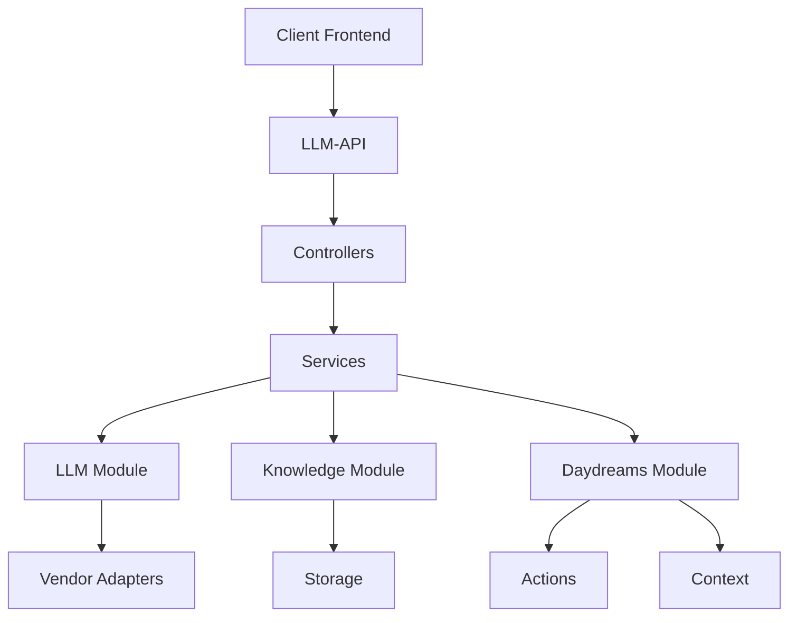
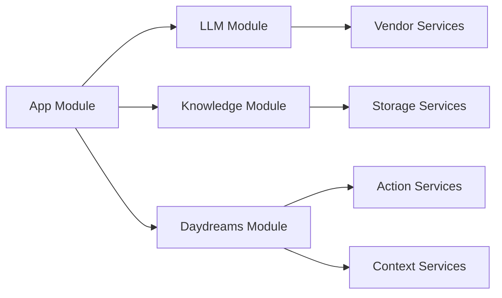
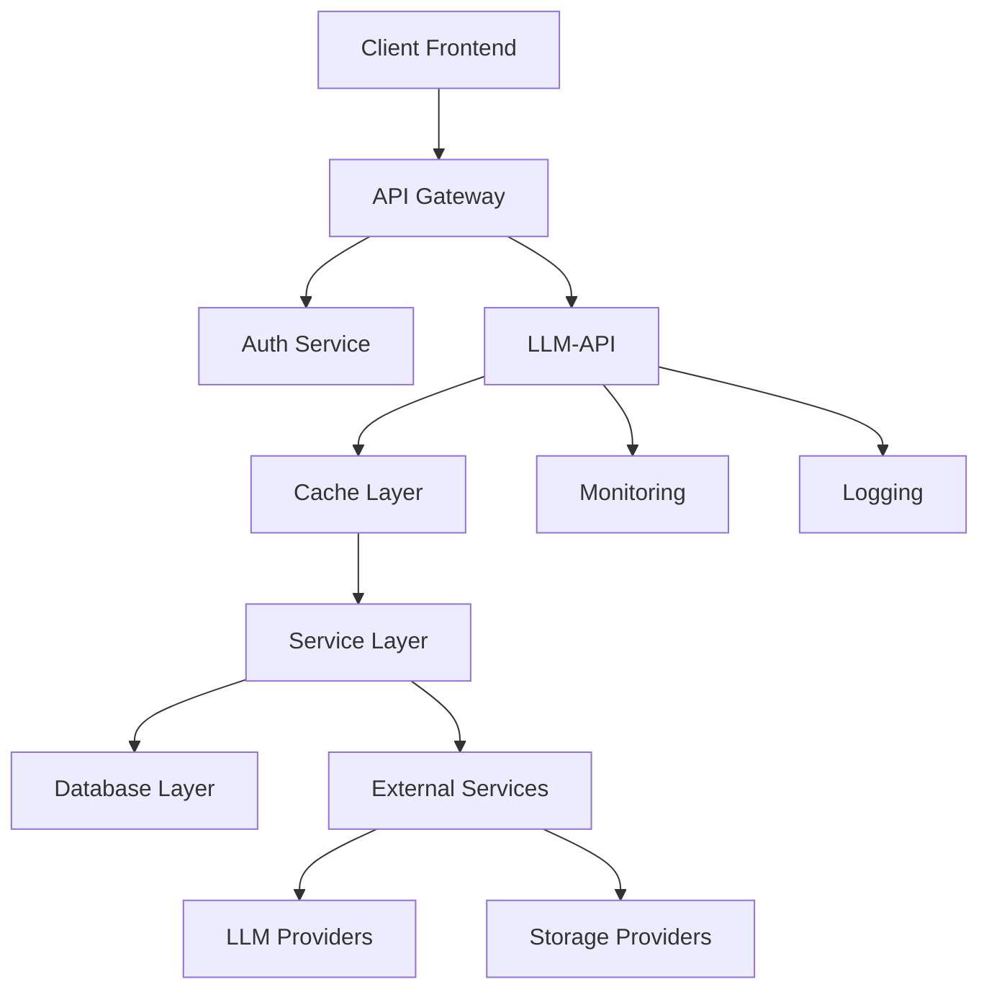

# Revue de Code : LLM-API

## Architecture Actuelle

## Structure des Modules

## Points d'Amélioration

### 1. Architecture et Structure

#### 1.1 Séparation des Responsabilités

- [ ] Implémenter une couche de service distincte pour chaque contrôleur
- [ ] Séparer la logique métier des contrôleurs
- [ ] Créer des interfaces pour les services

#### 1.2 Gestion des Erreurs

- [ ] Implémenter un système centralisé de gestion des erreurs
- [ ] Créer des classes d'erreur personnalisées
- [ ] Ajouter des intercepteurs pour la gestion globale des erreurs

#### 1.3 Configuration

- [ ] Utiliser la configuration par environnement
- [ ] Centraliser les constantes dans des fichiers de configuration
- [ ] Implémenter la validation de configuration

### 2. Sécurité

#### 2.1 Authentication & Authorization

- [ ] Ajouter un système d'authentification
- [ ] Implémenter des guards pour les routes
- [ ] Gérer les rôles et permissions

#### 2.2 Sécurité des Données

- [ ] Ajouter le chiffrement des données sensibles
- [ ] Implémenter la validation des entrées
- [ ] Ajouter des rate limiters

### 3. Performance

#### 3.1 Mise en Cache

- [ ] Implémenter un système de cache
- [ ] Optimiser les requêtes fréquentes
- [ ] Ajouter du cache en mémoire pour les données statiques

#### 3.2 Base de Données

- [ ] Optimiser les requêtes
- [ ] Implémenter des migrations
- [ ] Ajouter des indexes

### 4. Tests

#### 4.1 Tests Unitaires

- [ ] Augmenter la couverture des tests
- [ ] Ajouter des tests pour les services
- [ ] Implémenter des mocks pour les dépendances externes

#### 4.2 Tests d'Intégration

- [ ] Ajouter des tests end-to-end
- [ ] Tester les scénarios complexes
- [ ] Implémenter des tests de charge

### 5. Documentation

#### 5.1 API Documentation

- [ ] Ajouter Swagger/OpenAPI
- [ ] Documenter tous les endpoints
- [ ] Créer des exemples d'utilisation

#### 5.2 Code Documentation

- [ ] Ajouter des commentaires JSDoc
- [ ] Documenter les classes et méthodes importantes
- [ ] Maintenir un changelog

## Architecture Proposée

## Recommandations Prioritaires

1. **Sécurité**
   - Implémenter l'authentification
   - Ajouter la validation des entrées
   - Mettre en place des rate limiters

2. **Robustesse**
   - Améliorer la gestion des erreurs
   - Ajouter plus de tests
   - Implémenter le monitoring

3. **Performance**
   - Ajouter du caching
   - Optimiser les requêtes
   - Implémenter la mise à l'échelle

4. **Maintenabilité**
   - Améliorer la documentation
   - Standardiser le code
   - Ajouter des logs détaillés

## Plan d'Action

### Phase 1 : Fondations

1. Restructurer l'architecture
2. Implémenter l'authentification
3. Ajouter la gestion des erreurs

### Phase 2 : Robustesse

1. Augmenter la couverture des tests
2. Ajouter le monitoring
3. Implémenter le logging

### Phase 3 : Performance

1. Mettre en place le caching
2. Optimiser les requêtes
3. Préparer la mise à l'échelle

### Phase 4 : Documentation

1. Documenter l'API
2. Créer la documentation technique
3. Maintenir les guides d'utilisation
